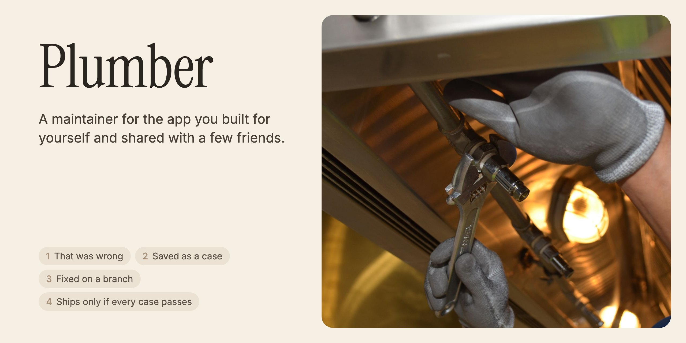
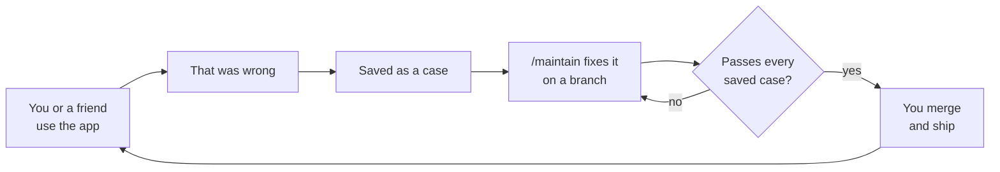

<p align="center">
  
</p>

<p align="center">
  <b>Works with</b> Claude Code · Codex · OpenCode &nbsp;·&nbsp; <b>No server, no account</b> &nbsp;·&nbsp; <b>Nothing to install</b>
</p>

> **Coding agents:** start with [AGENTS.md](AGENTS.md).

Your coding agent already writes the code. Plumber gives it a routine for looking after the app once people use it.

Every time the app gets something wrong, that becomes a saved case. Fixes happen on a branch. A fix only ships if it passes every case saved so far, yours and your friends'.

## What to tell your agent

Open your coding agent and point it at this repo. If you built the app, open the agent in the app's folder, not in Plumber. It reads the instructions and does the rest.

If your agent can't open GitHub links, clone this repo to a scratch folder outside your app and give it that path. If it can only fetch web pages, give it `https://raw.githubusercontent.com/crocsarecool/plumber/main/AGENTS.md`.

| You are | Say |
|---|---|
| 🛠️ Building an app | *"Set up Plumber in this app from github.com/crocsarecool/plumber"* |
| 🙋 Using a friend's app, and it got something wrong | *"I use \<friend\>'s \<app\> and it got something wrong. Help me report it, using github.com/crocsarecool/plumber"* |
| 🔄 Already using Plumber | *"Update Plumber from github.com/crocsarecool/plumber"* |

Setup looks at your app, asks you a few questions, and wires everything in on a branch. It takes about 10 minutes of your time, and the agent does the rest.

If you use [GitBot](https://github.com/gitbot-hq/GitBot), install **Plumber** from its Marketplace and start a thread in your app's folder. It does whichever of the three fits, without you pasting a link.

## How it works



There are two things to learn:

1. **"That was wrong"** in your app. It marks the last thing the app did as wrong, with an optional note. Your friends get **Send to \<you\>**, which saves one small file. They see exactly what's in it before they send it to you over WhatsApp, AirDrop or any other way.
2. **`/maintain`** in your agent. Run it yourself or on a schedule. It checks nothing that used to work has broken, collects what went wrong, saves each failure as a case, and fixes up to two things on a branch. Then it tells you in a few lines what happened. You decide what merges.

## What `/maintain` tells you

This is adapted from a real review of [Murmur](#where-it-came-from), a dictation app, on 29 Sep 2026. Cases are named by id, so nobody's words end up in the report.

```
Regressions: none. Every case that passed before still passes.
Fixed on maintain-2026-09-29:
  - Numbers read out digit by digit no longer go to the model.
    Case 2026-09-28T05-07-20.320Z: 2.1 s → 0.4 s, same digits.
  - A number on its own no longer gets a full stop.
    Case 2026-09-29T03-47-15.228Z: now passes (failed on main).
Still broken: none
Couldn't run: none
Decisions for you: none
Reply to friends: none
```

"Nothing worth changing today" is a good result. Plumber acts only on:
- a regression
- something a person flagged
- a problem it saw at least twice

It never merges or installs on its own.

## What it adds to your app

| File | Where | What it holds |
|---|---|---|
| `PLUMBER.md` | repo | What the app is for, what counts as wrong, and how to build, test, replay and ship |
| `LEARNED.md` | repo | What each fix taught. It's read before every fix, so old fixes don't get undone. |
| `.claude/skills/maintain/` | repo | The `/maintain` routine, versioned with your app |
| `traces.jsonl` | data folder | One line per thing the app did |
| `flags.jsonl` | data folder | Every "that was wrong" |
| `cases/` | data folder | Failures saved so they can be replayed against any build |
| `inbox/` | data folder | Friends' reports waiting for `/maintain` |

If your app already has some of this, like a log, test cases or a notes file, Plumber keeps it and adds only what's missing.

The data folder never goes into git, because it holds what people typed, said or asked. Nothing leaves anyone's machine unless they choose to send a report.

## Where it came from

Murmur is a dictation app built with Claude Code in a day. It got about 60 commits in its first four days, and most of them came from using it, not from planning. By then it had grown every part of a maintainer by hand:
- a log of every dictation
- a script that replays real recordings against each new build
- a daily review that fixes things on a branch
- a notes file so new fixes don't undo old ones

Plumber is that loop taken out of Murmur, so any app you built for yourself can have it from day one. [PRODUCT.md](PRODUCT.md) has the thinking behind it, and [NOTES.md](NOTES.md) explains why each rule exists.

## What's in this repo

| File | For |
|---|---|
| [AGENTS.md](AGENTS.md) | Any agent pointed at this repo. It works out what the person wants. |
| [SETUP.md](SETUP.md) | Setting Plumber up in an app, step by step |
| [skills/maintain/SKILL.md](skills/maintain/SKILL.md) | The `/maintain` routine |
| [FORMATS.md](FORMATS.md) | Every file Plumber reads and writes |
| [templates/](templates/) | Blank `PLUMBER.md` and `LEARNED.md` |

